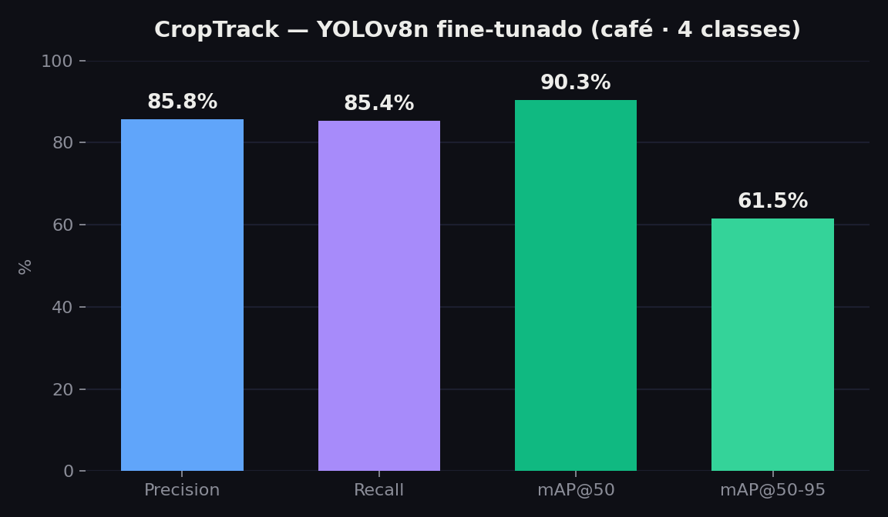

# Métricas dos modelos — CropTrack

> Métricas finais de **validação** registradas no treino (embutidas nos checkpoints Ultralytics). `(B)` = caixas / detecção de objetos.

## Modelo principal — `coffee_yolo_v1` (o fine-tuning)

Detector YOLOv8n fine-tunado para 4 classes de café (bicho-mineiro, ferrugem, cercosporiose, ácaro-vermelho).

| Métrica | Valor |
|---|---|
| **Precision** | **85.8%** |
| **Recall** | **85.4%** |
| **mAP@50** | **90.3%** |
| **mAP@50-95** | **61.5%** |

**Config de treino:** base `yolov8n.pt` · 15 épocas · imgsz 640 · batch 16 · optimizer `auto` · lr0 0.01 · Ultralytics 8.3.49 · treinado em 2024-12-18.

**Classes:** `brown_eye_spot`, `leaf_miner`, `leaf_rust`, `red_spider_mite`



## Comparativo entre detectores

| Modelo | Classes | Épocas | mAP@50 | mAP@50-95 | Precision | Recall |
|---|---|---|---|---|---|---|
| `coffee_yolo_v1` | 4 | 15 | 90.3% | 61.5% | 85.8% | 85.4% |
| `plant_disease_v1` | 29 | 10 | 33.1% | 22.8% | 25.0% | 42.7% |

## Como interpretar (pra banca)

- **mAP@50 90,3%**: com IoU ≥ 0,5, o modelo acerta a grande maioria das detecções de doença/praga — forte para a aplicação.
- **mAP@50-95 61,5%**: média em limiares de IoU mais rígidos (0,5→0,95); queda esperada, indica que as caixas são boas mas não perfeitamente justas.
- **Precision 85,8% / Recall 85,4%**: equilíbrio entre não alarmar à toa e não deixar passar lesões — bom trade-off para campo.

## Para o detalhamento completo (AP por classe + matriz de confusão + curvas)

As métricas acima são agregadas. Para gerar por classe, matriz de confusão e curvas PR/F1, rode a validação com o dataset (export do Roboflow com `data.yaml`):

```bash
cd "Modulo XV/backend"
./venv/bin/yolo detect val \
  model=models/coffee_yolo_v1.pt \
  data=/caminho/para/data.yaml \
  imgsz=640 split=val
# saída em runs/detect/val/: confusion_matrix.png, PR_curve.png,
# F1_curve.png, results.csv (AP por classe)
```